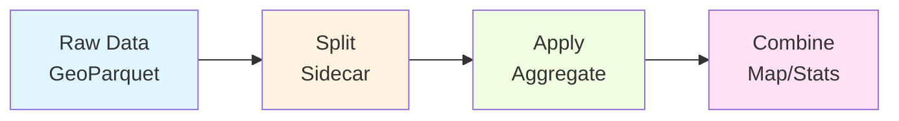

## Overview

HEALPyxel implements a **Split-Apply-Combine** pattern tailored for spherical geometry and large-scale spatial data processing. This pattern separates data indexing from aggregation, enabling efficient streaming and incremental updates.



## Stage 1: Split (The Sidecar)

Instead of rewriting your heavy raw data, HEALPyxel generates a **small Parquet file** containing only the `source_id` (index of the original data) and its corresponding `healpix_id`.

<CardGroup cols={2}>
  <Card title="Input" icon="database">
    - Raw observations (GeoParquet)
    - Geometries: points, polygons, tracks
    - Columns: lat, lon, or geometry
  </Card>
  <Card title="Output" icon="table">
    - Lightweight sidecar file
    - Columns: `source_id`, `healpix_id`, `weight`
    - ~1% size of original data
  </Card>
</CardGroup>

### Example: Generate Sidecar

<Tabs>
  <Tab title="CLI">
    ```bash
    healpyxel_sidecar \
      --input observations.parquet \
      --nside 64 128 \
      --mode fuzzy \
      --lon-convention 0_360
    ```
  </Tab>
  <Tab title="Python API">
    ```python
    from healpyxel import sidecar
    import geopandas as gpd

    # Load your spatial data
    gdf = gpd.read_parquet('observations.parquet')

    # Generate sidecar
    sidecar_df = sidecar.generate(
        gdf,
        nside=64,
        mode='fuzzy',
        order='nested',
        lon_convention='0_360'
    )

    # Result: DataFrame with source_id -> healpix_id mapping
    print(sidecar_df.head())
    #    source_id  healpix_id  weight
    # 0          0        7943     1.0
    # 1          1        8287     1.0
    # 2          2        5819     1.0
    ```
  </Tab>
</Tabs>

### Assignment Modes

<CardGroup cols={2}>
  <Card title="Fuzzy Mode" icon="wave-square">
    Assigns each observation to **all** HEALPix cells it touches. Recommended for footprints and polygons.
  </Card>
  <Card title="Strict Mode" icon="crosshairs">
    Assigns only if geometry is **fully contained** within a single cell. Use for point observations.
  </Card>
</CardGroup>

<Note>
  **Data Contract:** The sidecar file encodes metadata in its filename:
  
  ```
  observations.cell-healpix_assignment-fuzzy_nside-64_order-nested.parquet
  ```
  
  This ensures reproducibility and traceability.
</Note>

## Stage 2: Apply (Aggregation)

Join the sidecar with any column in your original dataset to calculate statistics (Mean, Std Dev, Count) per HEALPix cell.

<Tip>
  The aggregation step is completely **decoupled** from indexing. You can aggregate different columns without regenerating sidecars.
</Tip>

### Example: Aggregate by Cell

<Tabs>
  <Tab title="CLI">
    ```bash
    healpyxel_aggregate \
      --input observations.parquet \
      --sidecar-dir output/ \
      --sidecar-index 0 \
      --aggregate \
      --columns r750 r950 \
      --aggs median robust_std \
      --min-count 3
    ```
  </Tab>
  <Tab title="Python API">
    ```python
    from healpyxel import aggregate
    import pandas as pd

    # Load original data and sidecar
    df = pd.read_parquet('observations.parquet')
    sidecar_df = pd.read_parquet('observations-sidecar.parquet')

    # Aggregate by HEALPix cells
    agg_df = aggregate.by_sidecar(
        original=df,
        sidecar=sidecar_df,
        value_columns=['r750', 'r950'],
        aggs=['median', 'robust_std'],
        min_count=3
    )

    # Result: Statistics per HEALPix cell
    print(agg_df.head())
    #             r750_median  r750_robust_std  r950_median  r950_robust_std  n_sources
    # healpix_id                                                                         
    # 0              0.048616         0.003962     0.052283         0.002799          4
    # 1              0.051467         0.002799     0.054283         0.001888          6
    ```
  </Tab>
</Tabs>

### Available Aggregation Functions

The `aggregate` module supports these statistical functions:

| Function | Description | Use Case |
|----------|-------------|----------|
| `mean` | Arithmetic mean | Standard averaging |
| `median` | 50th percentile | Robust to outliers |
| `std` | Standard deviation | Measure of spread |
| `mad` | Median Absolute Deviation | Robust outlier detection |
| `robust_std` | MAD × 1.4826 | Robust spread estimate |
| `min` | Minimum value | Range analysis |
| `max` | Maximum value | Range analysis |

```python
from healpyxel.aggregate import AGG_LOOKUP

# All available functions
print(list(AGG_LOOKUP.keys()))
# ['mean', 'median', 'std', 'min', 'max', 'mad', 'robust_std']
```

<Note>
  **Robust statistics** (`mad`, `robust_std`) are recommended for planetary science data with measurement outliers.
</Note>

## Stage 3: Combine (The Map)

Results are combined into a final HEALPix map or streaming accumulator. You can:

1. **Export to GeoParquet** with cell geometries for GIS visualization
2. **Densify** to include all HEALPix cells (filling empty cells with NaN)
3. **Stream updates** using the accumulator for incremental processing

### Example: Attach Cell Geometry

<Tabs>
  <Tab title="CLI">
    ```bash
    healpyxel_to_geoparquet \
      --aggregate-path observations-aggregated.parquet \
      --output-dir output/ \
      --lon-convention -180_180
    ```
  </Tab>
  <Tab title="Python API">
    ```python
    from healpyxel.geospatial import healpix_to_geodataframe

    # Attach HEALPix cell polygons
    cells_gdf = healpix_to_geodataframe(
        nside=64,
        order='nested',
        lon_convention='0_360',
        pixels=agg_df.index.to_numpy(),
        fix_antimeridian=True
    )

    # Merge with aggregated data
    result_gdf = cells_gdf.merge(agg_df, on='healpix_id', how='left')

    # Save to GeoParquet (QGIS-compatible)
    result_gdf.to_parquet('observations-final.geo.parquet')
    ```
  </Tab>
</Tabs>

## Why This Pattern?

<CardGroup cols={2}>
  <Card title="Non-Destructive" icon="shield-check">
    Original data files remain untouched. Sidecar files are small and disposable.
  </Card>
  <Card title="Flexible" icon="wand-magic-sparkles">
    Aggregate different columns without re-indexing. Change statistics without re-processing.
  </Card>
  <Card title="Scalable" icon="chart-line">
    Process TB-scale datasets using streaming and parallel Dask workflows.
  </Card>
  <Card title="Reproducible" icon="rotate">
    Metadata-rich filenames and JSON sidecar ensure full provenance tracking.
  </Card>
</CardGroup>

## Sparse vs Dense Output

### Sparse (Default)

Only cells with observations are written to output:

```python
# Sparse: 10,860 cells with data (out of 49,152 total at nside=64)
agg_df = aggregate.by_sidecar(original=df, sidecar=sidecar_df, ...)
len(agg_df)  # 10860
```

### Dense (Densified)

All HEALPix cells included, empty cells filled with NaN:

```bash
healpyxel_aggregate \
  --input observations.parquet \
  --sidecar-index 0 \
  --aggregate \
  --columns value \
  --densify  # ← Include all cells
```

```python
from healpyxel.aggregate import densify_healpix_aggregates
import healpy as hp

# Densify to full grid
nside = 64
n_pixels = hp.nside2npix(nside)  # 49,152

dense_df = densify_healpix_aggregates(agg_df, nside=nside)
len(dense_df)  # 49152 (all cells)
```

<Tip>
  Use **sparse** output for storage efficiency. Use **dense** output for visualization and numpy-based map operations.
</Tip>

## Streaming Updates (Advanced)

For incremental data ingestion (e.g., daily mission downlinks), use the **accumulator** pattern:

```python
from healpyxel import accumulator, finalize

# Day 1: Initialize state
state_df = accumulator.update_state(
    batch=df_day1,
    sidecar=sidecar_df,
    value_columns=['r750', 'r950'],
    state=None  # First run
)

# Day 2+: Incremental update
state_df = accumulator.update_state(
    batch=df_day2,
    sidecar=sidecar_df,
    value_columns=['r750', 'r950'],
    state=state_df  # Pass previous state
)

# Finalize: Compute statistics from accumulated state
final_df = finalize.from_state(
    state=state_df,
    aggs=['mean', 'std', 'median', 'robust_std']
)
```

<Note>
  The accumulator maintains running statistics (count, mean, M2, tdigest) without storing raw observations, enabling memory-efficient streaming.
</Note>

## Next Steps

<CardGroup cols={2}>
  <Card title="Sidecar Pattern" icon="link" href="/concepts/sidecar-pattern">
    Learn about non-destructive indexing with sidecar files
  </Card>
  <Card title="API Reference" icon="code" href="/api/aggregate">
    Explore aggregation functions and parameters
  </Card>
</CardGroup>
